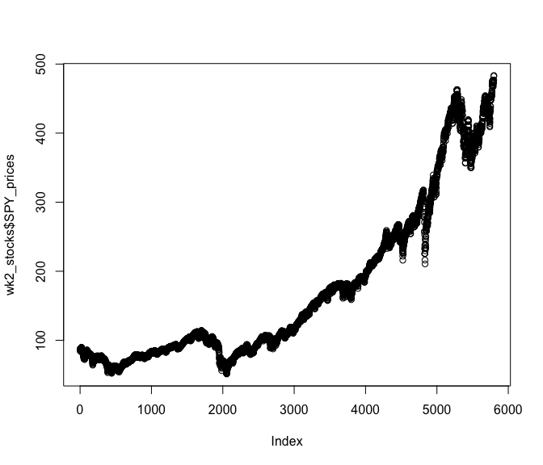

dse trial
================
jiya
2024-01-24

``` r
wk2_stocks <- readRDS("~/DSE3101/wk2_stocks.rds")
str(wk2_stocks)
```

    ## 'data.frame':    5798 obs. of  4 variables:
    ##  $ SPY_prices : num  88.1 87.1 84.3 84.9 84.7 ...
    ##  $ SPY_returns: num  0.04804 -0.01076 -0.03264 0.00774 -0.00264 ...
    ##  $ SPY_vol    : num  88.1 87.1 84.3 84.9 84.7 ...
    ##  $ date       : Date, format: "2001-01-03" "2001-01-04" ...

``` r
sum(wk2_stocks$SPY_returns)
```

    ## [1] 2.183304

``` r
mean(wk2_stocks$SPY_returns)
```

    ## [1] 0.0003765616

``` r
sd(wk2_stocks$SPY_returns)
```

    ## [1] 0.01221943

``` r
plot(wk2_stocks$SPY_prices)
```

<!-- -->
